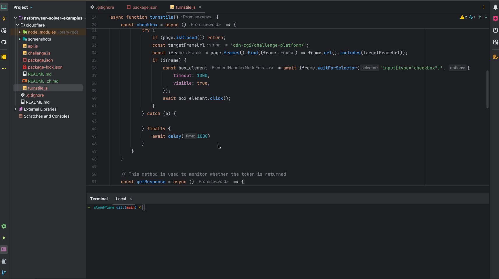
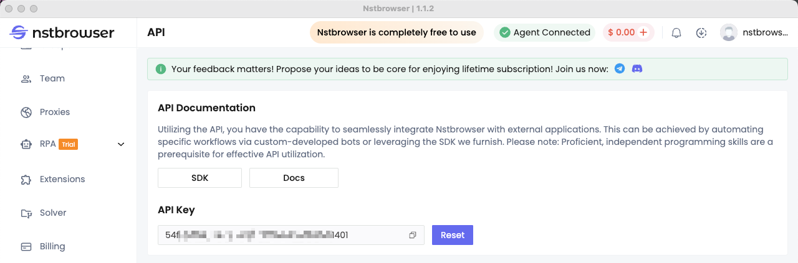

# Nstbrowser-solver-Cloudflare

## Bypass Cloudflare Turnstile with Nstbrowser 🔥🔥🔥
Welcome to this tutorial! In this tutorial, we will use Nstbrowser to complete the steps of fetching the turnstile token from a form that used the Cloudflare Turnstile site.

Let's understand how it works through a simple example.



### **Step 1: Install Nstbrowser**

First, download the Nstbrowser client installer from this URL: [https://www.nstbrowser.io/download.](https://www.nstbrowser.io/download%E3%80%82)

After the download is complete, open the installer and follow the prompted steps to complete the installation process. After the installation is complete, you can find and launch the Nstbrowser client on your device.

### **Step 2: Set up your Nstbrowser**

Register an account at this address: [https://app.nstbrowser.io/account/register.](https://app.nstbrowser.io/account/register%E3%80%82)

After successful registration, log in to the Nstbrowser client with your registration information. After successful login, you can generate your own exclusive `API Key` in the API menu.



### **Step 3: Write Token acquisition code**

Now, create a node project, create an `api.js` file in the project directory, and insert the following code to create and start a random fingerprint browser instance.

```jsx

// Api Docs: https://apidocs.nstbrowser.io/api-5418530
export async function getBrowserWSEndpoint(apiKey) {
    const config = {
        once: true, // one_time browser
        headless: false, // support: true, 'new'
        autoClose: false,
        // remoteDebuggingPort: 9223,
        fingerprint: {
            name: 'test-turnstile',
            platform: 'windows', // support: windows, mac, linux
            kernel: 'chromium', // only support: chromium
            kernelMilestone: '120', // support: 113, 115, 118, 120
            hardwareConcurrency: 2, // support: 2, 4, 8, 10, 12, 14, 16
            deviceMemory: 8, // support: 2, 4, 8
        },
    };

    const query = new URLSearchParams({
        'x-api-key': apiKey,
        config: JSON.stringify(config),
    }).toString();

    const resp = await fetch(`http://localhost:8848/api/agent/devtool/launch?${query}`)
    const json = await resp.json();
    return json.data
}
```

http://localhost:63343/markdownPreview/369012496/cloudflare?_ijt=qpl7175d4b69hlo0n17ufir43o

Next, create another `turnstile.js` file, and insert the following code to automate the acquisition of Turnstile's Token data using Puppeteer.

!http://localhost:63343/markdownPreview/1402208692/commandRunner/run.png

```jsx
import puppeteer from "puppeteer-core";
import {getBrowserWSEndpoint} from "./api.js";

const apiKey = 'API Key'

async function delay(time) {
    return new Promise((resolve) => {
        setTimeout(resolve, time);
    });
}

let browser = null;

async function turnstile() {
    const {webSocketDebuggerUrl} = await getBrowserWSEndpoint(apiKey)
    browser = await puppeteer.connect({
        browserWSEndpoint: webSocketDebuggerUrl,
        defaultViewport: null,
    });

    let resolveToken = null;
    const tokenPromise = new Promise((resolve) => {
        resolveToken = resolve;
    });

    const page = await browser.newPage();

    // This method is used to monitor whether the Checkbox exists on the page and click it
    const checkbox = async () => {
        while (true) {
            try {
                if (page.isClosed()) return;
                const targetFrameUrl = 'cdn-cgi/challenge-platform/';
                const iframe = page.frames().find((frame) => frame.url().includes(targetFrameUrl));
                if (iframe) {
                    const box_element = await iframe.waitForSelector('input[type="checkbox"]', {
                        timeout: 1000,
                        visible: true,
                    });
                    await box_element.click();
                }
            } catch (e) {

            } finally {
                await delay(1000)
            }
        }
    }

    // This method is used to monitor whether the token is returned
    const getResponse = async () => {
        while (true) {
            if (page.isClosed()) return;

            const response = await page.evaluate(() => {
                const token = window?.turnstile?.getResponse()
                if (token) {
                    return {
                        data: token,
                        userAgent: navigator.userAgent,
                    }
                }
            });
            if (response) {
                resolveToken(response);
                page.close().then()
                return;
            }
            await delay(1000)
        }
    }

    getResponse().then()
    checkbox().then()

    await page.goto('https://xxxx.com/turnstile_url');
    return tokenPromise;
}

// Test get trunstile token
turnstile().then(result => {
    console.log(result)
}).catch(err => {
    console.error(err)
}).finally(() => {
    if (browser) {
        browser.close()
    }
})
```

You can view the full sample code at the Nstbrowser official open source repository: https://github.com/Nstbrowser/nstbrowser-solver-examples.git
